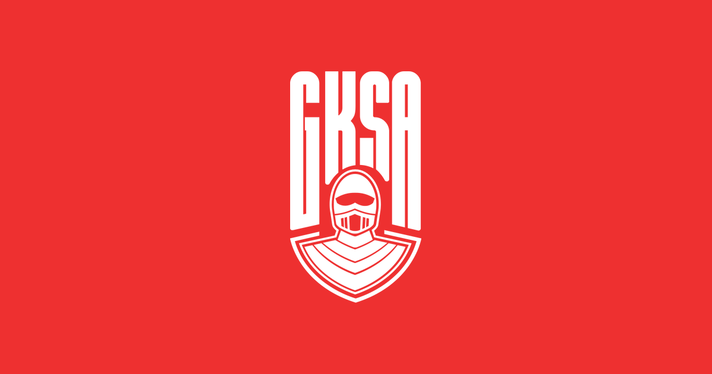

<div align="center">



# Golden Knights Soccer Academy

**Youth football coaching in Midrand.** Strategy, brand assets, page content, and the full website build for the official GKSA online presence.


</div>

---

## Overview

This repository is the single source of truth for the GKSA digital project. It contains the strategic plan and blueprint, all page content specs, the complete brand asset pack, and the production website build. The site is a fast, mobile-first marketing site built to win two audiences at once: families looking to book a trial, and businesses looking to sponsor.

## Repository structure

```
Golden Knights Soccer Academy/
├── README.md                          You are here
├── docs/
│   ├── website-plan-and-blueprint.docx   Strategy, sitemap, sponsor funnel, roadmap
│   └── sponsorship-proposal.pdf          Academy sponsorship proposal (source)
├── content/                           Page content specs, one file per page
│   ├── README.md                         Index of all 10 pages with phases and audiences
│   └── 01-home.md … 10-shop.md
├── brand/                             Web-ready asset pack
│   ├── README.md                         Asset usage notes and colour reference (#EE3030)
│   ├── gksa-logo.svg, logo-source.png    Master logo and source
│   └── icons, og-image, twitter-card, site.webmanifest, favicons …
├── media/
│   ├── photos/                           academy-01 … academy-06 (training and match day)
│   └── audio/                            soccer-laduma-spotlight.mp3 (podcast feature)
└── website/                           React + TypeScript website (see website/README.md)
```

## Where to start

| Task | Go to |
|------|-------|
| Understand the project strategy | `docs/website-plan-and-blueprint.docx` |
| Write or review page copy | `content/` (one `.md` per page) |
| Drop brand assets into the site | `brand/` (see `brand/README.md` for usage) |
| Work on the website build | `website/` (see `website/README.md`) |
| Understand the shop data model | `content/10-shop.md` |

## Pages (10)

Home · About · Programmes · Sponsors · Contact · Teams & Fixtures · Gallery · News · Register · **Shop**

See `content/README.md` for per-page phase, audience, and priority notes.

## Website

The `website/` folder is a standalone React 18 + TypeScript + Vite 6 application. Full tech stack, scripts, and component docs are in `website/README.md`.

**Key traits:**
- Fully interactive shop: browse, filter, sort, add to a persistent cart, and check out.
- Product images sourced from Pexels (free, hotlink-safe) with graceful fallback to branded tiles.
- Catalogue in `website/src/data/products.ts` mirrors the MySQL schema and stores prices in cents.

## Backend (pending)

A PHP REST API to replace the in-memory catalogue and connect a South African payment gateway is planned. This work begins once the academy confirms the site. The in-memory data shapes in `products.ts` and `cart.tsx` are designed to swap out without touching the UI.

## Brand

Red `#EE3030` · Oswald (display) · Archivo (headings) · Inter (body). Source pack in `brand/`. Drop the folder contents straight into `website/public`.

> House style: no em dashes anywhere. Use commas, colons, or parentheses.

## Open items to confirm

- Founding year (2016?) and founder name spelling (Katlego Ntsheke / Katleho Ntsekhe).
- Age groups, training schedule, venue, and current fees.
- Training base address (for the embedded map).
- Current sponsor list, logos, and tier assignments.
- Form recipient email(s) and a branded `info@` address.
- Domain name confirmed and hosting arranged.
- Payment gateway choice (Peach Payments, PayFast, or similar).
